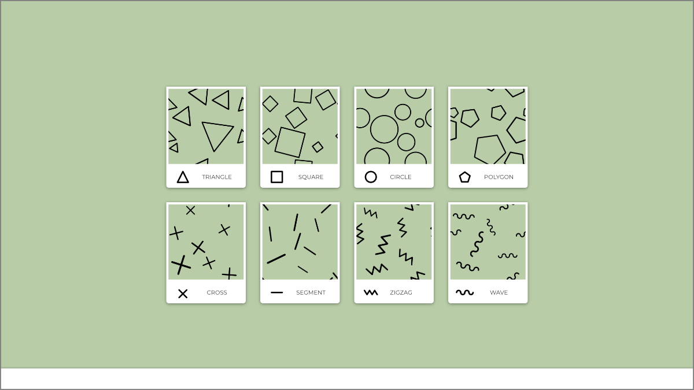
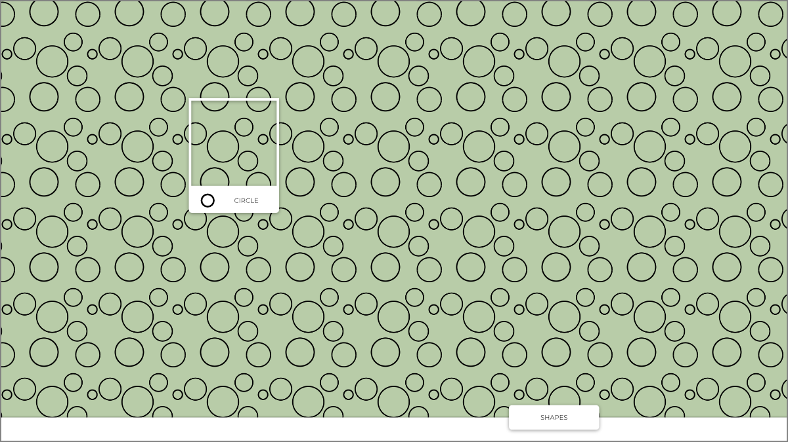

# layout-challenge

## Brief :

### /index

- une barre de menu en bas de l'écran
- un seul bouton

_ultra minimaliste_ :bowtie:

- tout est placé sur une grille de 4 colonnes (responsive la grille... on est pas des sauvages :grin:)

- le menu s'ouvre en éventail
- on a un maximum de 5/6 choix de formes, plus un bouton [MORE](#shape) qui ouvre une nouvelle page avec la liste de toutes les formes disponibles.

_on fait déjà moins les malins la !_

### /shape

- liste de toutes les formes (toujours sur la grille)  
  Ici il n'y en a que 8 mais vous pouvez en mettre autant que vous voulez.

_pas de bouton `SHAPES` quand on est sur `/shape`_

### /shape/[forme]

- quand on clique sur une forme (depuis la liste ou depuis le menu éventail) on passe sur sa page dédiée `/shape/[forme]`
- on affiche une seule carte et le motif en background

_notez l'alignement entre l'aperçu de la carte et la position du background :art:_

### Note

Vous trouverez les images _tileable_ dans le dossier `images`  
Celle des cercles par exemple :

GO ! :checkered_flag:
